# Gaming Server

_An Easy Boot2Root box for beginners_

Esta máquina es un _capture the flag_ clásico, sin ayudas ni guías de como tienes que ir haciendolo.

## Análisis

Empezamos el análisis con un escaneo de puertos, y encontramos la siguiente información:

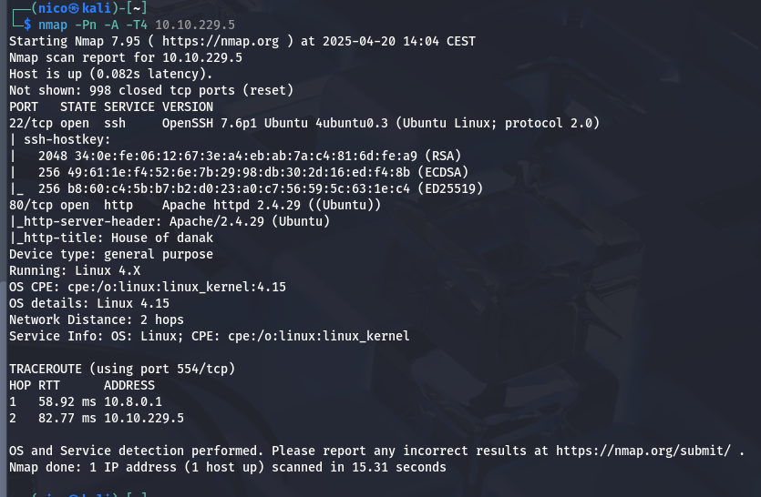

Tenemos el puerto 22 y el 80, investiguemos el `Apache` primero:

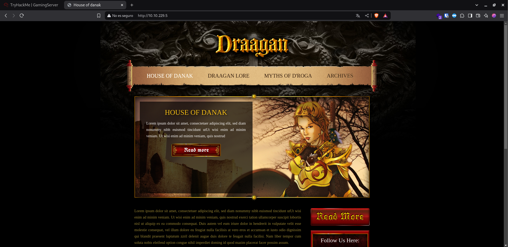

Tenemos mucho donde investigar, primero miraré el código fuente en busca de información.

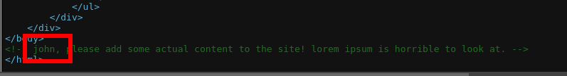
> Posible usuario.

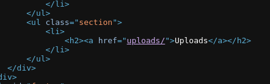

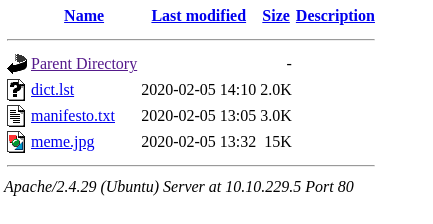

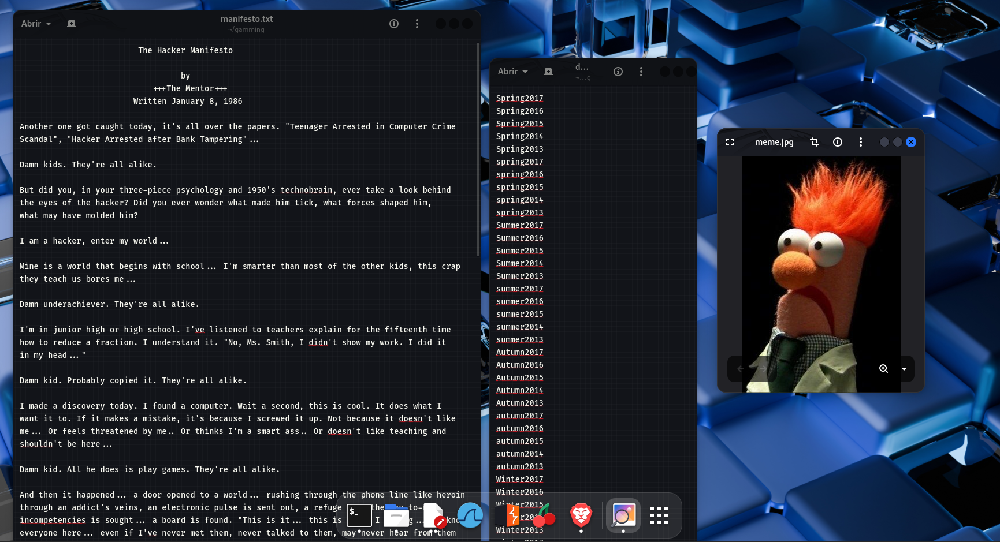

Un manifiesto hacker, un diccionario y una foto. Entiendo que el diccionario es para hacer hydra con john, pero el resto voy a analizarlo debidamente.

Parece que la foto tiene algo escondido, voy ha hacerle un `stegcracker` mientras continuamos.

Le hacemos un `gobuster` a la página principal:

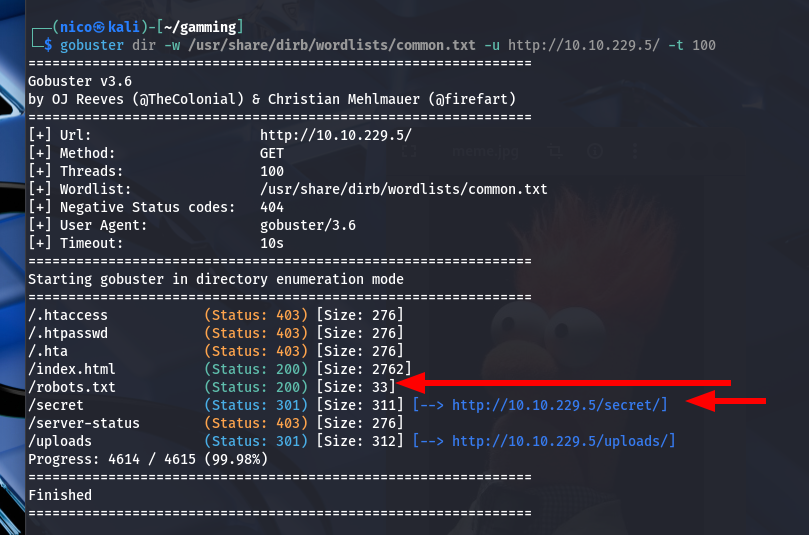

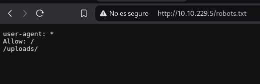
> :)

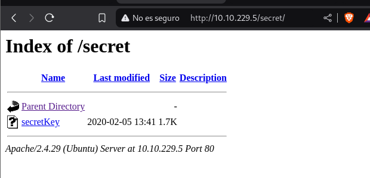
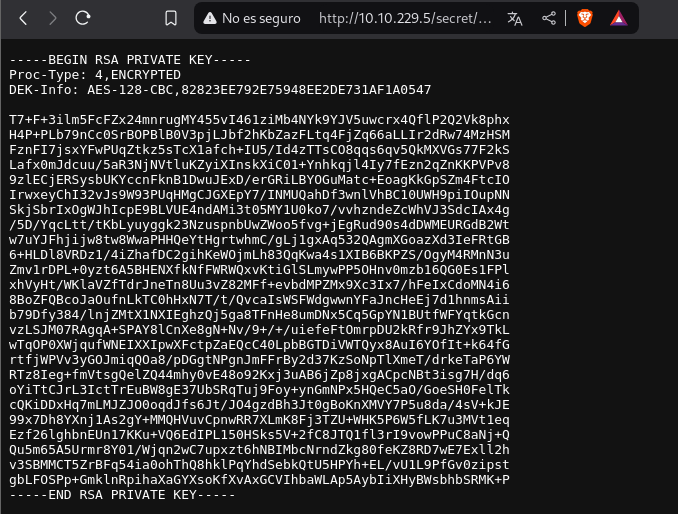

Parece una clave RSA, podríamos usarla para iniciar sesión con john, pero antes tenemos que `crakearla`:

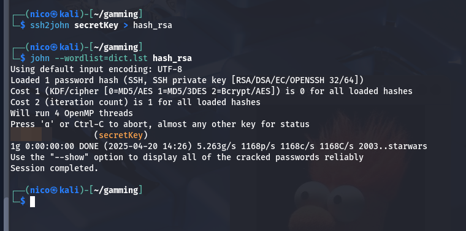

El diccionario era para esto al final.

Le cambiamos los permisos al archivo e iniciamos sesión con esa contraseña:

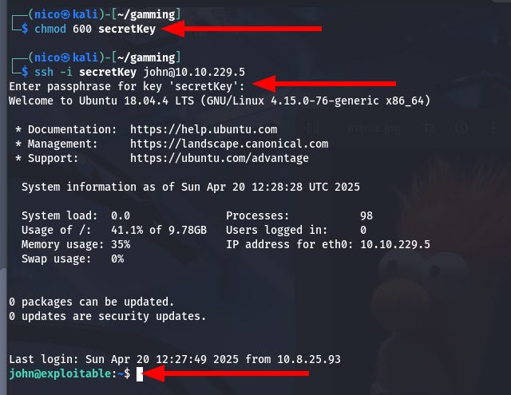

Genial, ya estamos dentro del sistema y solo queda escalar privilegios.

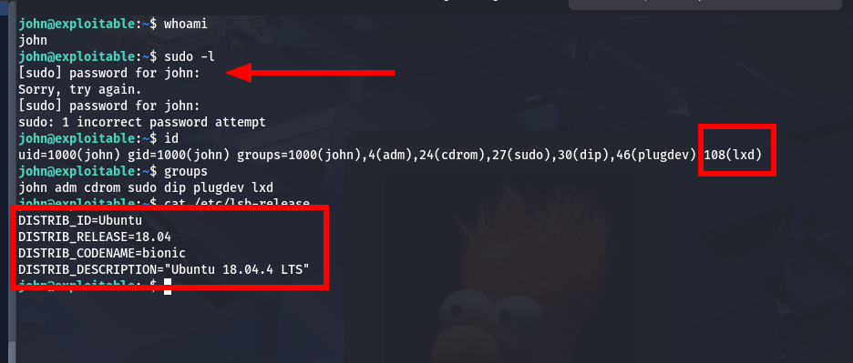

Al no tener la contraseña del usuario se nos dificulta mucho la escalada, pero vemos que pertenece al grupo _lxd_. Encontramos este [exploit](https://www.exploit-db.com/exploits/46978):

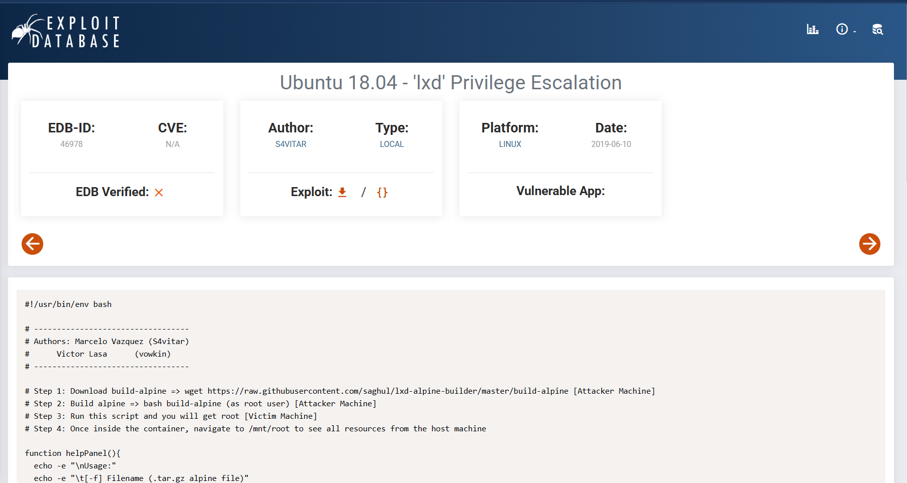

Nos lo descargamos, lo pasamos a la máquina con `python3 -m http.server` y lo ejecutamos:

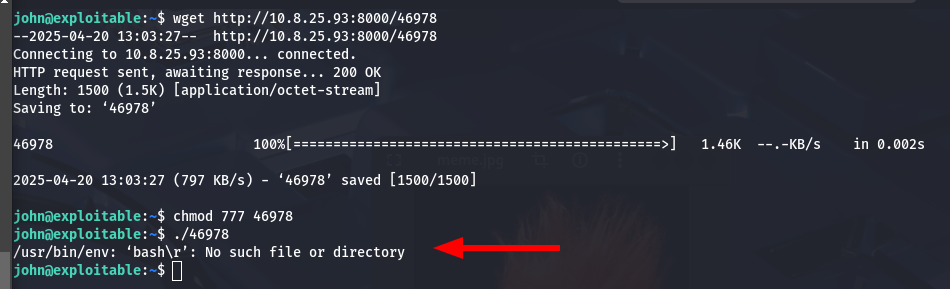
> ...

Vale, tenemos que seguir los pasos que indica el exploit:

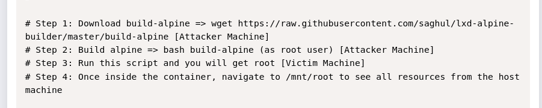

1. Descargar la build de apline

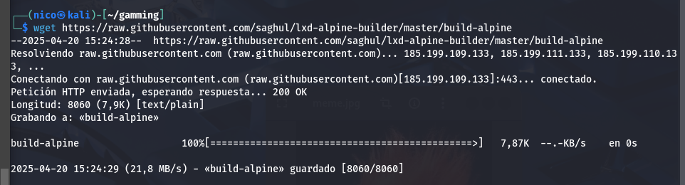

2. _Construir_ alpine

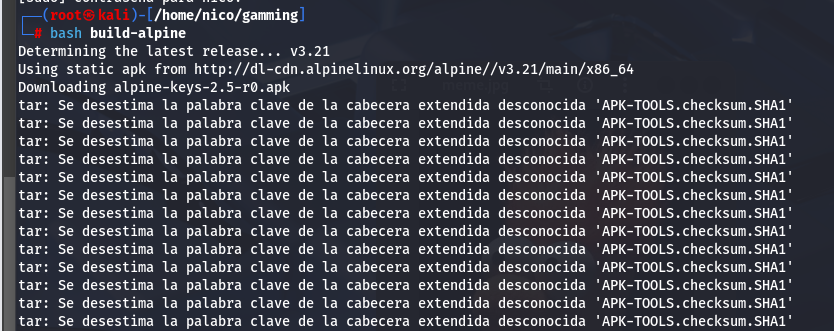

3. Iniciar el script en la máquina victima

Sigue sin funcionar.